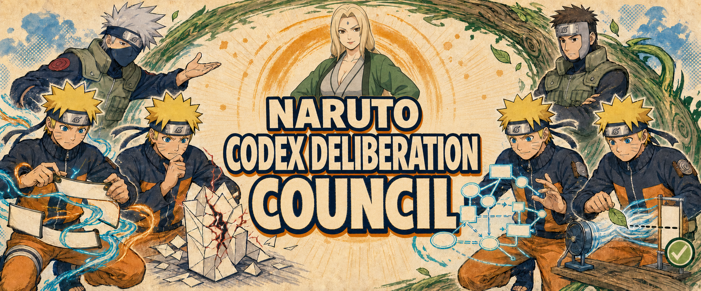

# Codex Deliberation Council

> **One Naruto. Four parallel training paths. Two supervisors. One accumulated
> lesson.**

## The Training Arc Behind The Protocol

Naruto meets Sasuke again and the gap is impossible to ignore. Determination is
not the problem. He already knows the Rasengan, but forcing the same approach
harder will not create the next technique. He needs a way to learn faster,
practice safely, and turn many failed attempts into one usable lesson.

That is where Kakashi changes the training itself.

This skill is inspired by manga chapters **311-341**, spanning
[Volume 35](https://naruto-official.com/en/comics/01_117),
[Volume 36](https://naruto-official.com/en/comics/01_118),
[Volume 37](https://naruto-official.com/en/comics/01_119), and
[Volume 38](https://naruto-official.com/en/comics/01_120). Kakashi recognizes
that a shadow clone does more than fight beside Naruto: when it disperses, its
experience returns to the original. Parallel practice can therefore collapse
into one accumulated lesson. The
[official technique retrospective](https://naruto-official.com/en/news/01_1694)
describes that transfer directly.

The training has a concrete progression:

1. Chapters **311-312** establish the need for a new technique after Naruto
   confronts the renewed gap with Sasuke.
2. Chapter **315** explains clone experience transfer and identifies Naruto's
   Wind chakra affinity.
3. Chapters **316-318** train Wind transformation by cutting a leaf. In chapter
   **317**, Asuma contributes a short specialist lesson about the nature of Wind
   chakra.
4. Chapters **318-320** scale the exercise from a leaf to the waterfall created
   and expanded by Yamato.
5. Chapter **321** begins the harder step: combining Wind Release with the
   Rasengan.
6. Chapters **329-330** separate shape and nature transformation between two
   clones and produce Wind Release: Rasengan.
7. Chapter **339** unveils the first usable Wind Style: Rasen Shuriken.
8. Chapters **340-341** turn an unstable first combat attempt into a successful
   strike against Kakuzu.

The surrounding roles matter as much as the technique. **Kakashi** is the main
teacher and architect of the accelerated method. **Asuma** is a narrow domain
specialist who contributes exactly the missing Wind-nature insight. **Yamato**
does not replace Kakashi as teacher. He prepares the training ground, extends
the waterfall exercise, watches the physical strain, and can restrain the
Nine-Tails' chakra if Naruto loses control. The
[official Naruto retrospective](https://naruto-official.com/en/news/01_1610)
connects accelerated training, Wind nature, Rasen Shuriken, and Kakuzu; this
[official retrospective](https://naruto-official.com/en/news/01_1308) shows
Yamato's restraint role.

That arc becomes one software rule:

> Parallel work needs one learner, shared evidence, genuinely different
> training methods, protected independence, an explicit safety boundary, and a
> final owner who remains accountable.

## From Manga Training To A Codex Protocol

The implementation is inspired by the learning structure, not a literal copy
of the story. It does not create four character personas and it does not run
four identical prompts. It instantiates one shared Naruto actor identity through
four independent, method-diverse training paths.

| Manga-inspired role | Protocol responsibility |
|---|---|
| **Tsunade Senju, Fifth Hokage** | Public identity of the top-level role assumed by the parent Codex process. Hokage frames the task, controls phases, owns the stop decision, and writes the final synthesis. Tsunade is not a seventh child profile or an additional solver. |
| **Four shadow-clone instances** | Share `actor_identity_id: naruto_uzumaki`, receive the same complete task and common packets, use four fixed methods, commit before seeing peer work, then revise once in the original threads. |
| **Kakashi** | Creates one common, non-solution training brief and receives the manifest-derived method matrix without changing it. After blind work, he validates the barrier and moderates evidence comparison without selecting a winner. |
| **Yamato** | Validates identity, method assignments, packet integrity, protected boundaries, and phase safety. He returns `pass`, `hold`, or `blocked`, but never coaches an individual instance or proposes a solution. |
| **Asuma's consultation** | Represents narrow, evidence-backed specialist input added to the shared source packet when a task needs it. It is not a permanent extra profile. |

The four training paths are fixed before fan-out:

| Runtime profile | Method | Purpose |
|---|---|---|
| `naruto_clone_integrator` | `naruto_integrative_method.v1` | Build the most useful complete route, reconcile constraints, and preserve a practical fallback. |
| `naruto_clone_challenger` | `naruto_adversarial_method.v1` | Falsify weak premises, expose hidden cost and risk, and construct a safe alternative. |
| `naruto_clone_strategist` | `naruto_systems_method.v1` | Map ownership, dependencies, source-of-truth boundaries, and maintainability. |
| `naruto_clone_verifier` | `naruto_empirical_method.v1` | Build a complete hypothesis-led route with discriminating tests, observables, decision thresholds, and fallback or rollback conditions. |

```text
Tsunade as Hokage frames the mission, shared evidence, and manifest-derived method matrix
        -> Kakashi fixes one common brief and preserves the matrix unchanged
        -> Yamato validates identity, routing, and safety
        -> four Naruto training instances solve the whole task independently
        -> candidate solutions are committed behind one blind barrier
        -> one byte-identical reveal returns to the same four threads
        -> each instance revises without changing identity or method
        -> Kakashi reconciles evidence; Yamato reports phase safety
        -> Tsunade as Hokage accumulates the four lessons into one synthesis
```

This is not four agents chatting until they agree. It is a controlled training
ground with identical evidence, four explicit methods, one reveal, one
same-thread revision, reproducible supervision, and a traceable final decision.

The banner is original, unofficial fan art created for this repository. It is
not part of the MIT-licensed project materials and does not reproduce a manga
panel, dialogue, or an official logo. This project is not affiliated with or
endorsed by Masashi Kishimoto, Shueisha, VIZ Media, or the *Naruto* franchise.
Its public provenance, digest, QA, and delivery record is stored in
[`manifest/assets.json`](manifest/assets.json).

## What It Is

Codex Deliberation Council is a request-only skill for exploring one complete
problem through four independent methods before one evidence-weighted synthesis.
The exact compatibility trigger is `$naruto`.

The deliberation runtime is read-only. It does not grant permission to edit
files, spawn nested agents, call providers or APIs, use MCP, upload, push,
install, delete, or write project memory.

## Status

- Standalone package version: `1.0.0`
- Skill name: `naruto`
- Trigger: exact, case-sensitive first non-empty token `$naruto`
- Runtime profiles: four Naruto training instances, Kakashi, and Yamato
- Shared actor identity: `naruto_uzumaki`
- Parent role: Tsunade Senju as Hokage; no separate Hokage profile is bundled
- Conditional host role: independent `final_qa` reviewer for consequential results; not bundled
- Dependencies: Node.js 22 or newer for validation and installation helpers
- External services: none

Version `1.0.0` freezes the public trigger, six runtime profile IDs, four method
IDs, packet schemas, installer boundaries, and standalone package layout. The
release suite validates those contracts, isolated project and user installs,
upgrade behavior, checksums, and method fixtures. Host capabilities such as
profile capacity and same-thread follow-up remain runtime acceptance checks and
fail closed when unavailable; see
[`docs/release-acceptance-v1.0.0.md`](docs/release-acceptance-v1.0.0.md).

## Activation

Valid:

```text
$naruto Review this architecture and recommend a verified route.
```

```text
   $naruto
Compare these two implementation plans.
```

These do not activate the skill:

```text
naruto Review this architecture.
$Naruto Review this architecture.
$naruto: Review this architecture.
Please use $naruto later in this request.
`$naruto` is the command name.
> $naruto Review this architecture.
- $naruto Review this architecture.
```

The token must be the first non-empty token, must be followed by whitespace and
a task, and must not be quoted, escaped, fenced, or prefixed by prose or a list
marker.

## Deliberation Architecture

1. Hokage opens `loop_control_fit` with `max_iterations: 1`, fixes acceptance
   criteria, and creates one canonical hashed evidence packet.
2. Hokage builds `method_matrix.v1` from the package manifest. It binds the one
   actor identity to four unique instance IDs and four unique methods before
   fan-out.
3. `kakashi_hatake` derives one neutral `training_guidance_packet.v1`. It may
   clarify criteria and checks, but cannot recommend an answer, rank methods,
   add private evidence, or vary by instance.
4. Four `naruto_training_instance_envelope.v1` artifacts bind each runtime to
   one matrix assignment and the common packet hashes. Only the instance ID,
   assigned method ID, and resulting envelope digest may differ.
5. `yamato` validates the source, method matrix, envelopes, guidance, and
   protected boundaries in `safety_control_packet.v1`. Fan-out starts only
   after `pass`; one common repair is permitted after `hold`, and a second
   non-pass blocks the run.
6. The four Naruto instances receive byte-identical common artifacts plus their
   allowlisted routing envelope. Each solves the entire task independently.
7. Every output binds actor, instance, method, source, matrix, envelope,
   guidance, and safety hashes before the commit barrier opens.
8. Kakashi prepares one byte-identical reveal packet. The same four open threads
   revise exactly once, retaining actor identity and method assignment. Matching
   opaque thread-handle hashes and an experience-transfer claim map prove
   continuity.
9. `protocol_run_manifest.v1` records packet identity, phase state, no-contact
   attestations, same-thread proofs, and regressions. Nine immutable
   `protocol_checkpoint.v1` artifacts form the checkpoint chain.
10. Kakashi reconciles evidence lineages, minority objections, collective blind
    spots, quick surrender, and performative dissent. Yamato produces a final
    `safety_report.v1` from phase and boundary metadata only.
11. Hokage synthesizes with claim-level provenance. Consequential outputs
    receive role-blind independent final QA with reproducible findings before
    the stop decision.

Completion speed, majority, answer length, confidence, and style are never
evidence. One independence key represents one underlying source lineage, even
when all four instances cite it. A supported minority objection can block
verified consensus.

Possible result statuses are `verified_consensus`, `provisional_consensus`,
`structured_dispute`, and `blocked`. Stop decisions are `stop_sufficient`,
`patch_one_gap`, `ask_user`, and `blocked`. The protocol never starts a second
panel automatically.

## Repository Layout

```text
.agents/skills/naruto/   Skill instructions, cards, references, templates,
                         fixtures, and the portable validator
.codex/agents/           Six project-scoped read-only custom-agent profiles
docs/                    Compatibility and naming-risk notes
integrations/            Optional workspace adapter guidance
manifest/                Package structure, migration, and release metadata
scripts/                 Installer, checksums, security tests, and validation
SHA256SUMS               SHA-256 for every package file except itself
```

The layout mirrors project-scoped Codex locations. Cloning the repository and
opening Codex from this directory exposes the skill and profiles as project
configuration.

## Validate

No dependency installation is required:

```bash
npm run validate
npm test
```

Both commands run the same suite. It checks the trigger, shared identity,
method matrix, routing envelopes, supervision, commit and revision integrity,
loop fixtures, six read-only profiles, installer security, package hygiene, and
all recorded SHA-256 checksums.

## Install

### Project scope

Preview changes, then install into an existing project:

```bash
node scripts/install.mjs --scope project --target /absolute/path/to/project --dry-run
node scripts/install.mjs --scope project --target /absolute/path/to/project
```

This copies the skill to `.agents/skills/naruto/` and the six profiles to
`.codex/agents/`. Existing differing files are never overwritten unless
`--force` is supplied.

### User scope

Preview and install for the current user:

```bash
node scripts/install.mjs --scope user --dry-run
node scripts/install.mjs --scope user
```

The skill is copied to `$HOME/.agents/skills/naruto/`. Profiles are copied to
`$CODEX_HOME/agents/` when `CODEX_HOME` is set, otherwise to
`$HOME/.codex/agents/`.

Codex normally detects skill changes automatically. If the skill or profiles do
not appear, restart Codex and start a new task. Test configuration changes in a
new task so old thread context cannot affect trigger checks.

## Update

Version `1.0.0` updates `0.4.x` installations in place because all six runtime
IDs remain stable. Preview differences first, then use `--force` only for
reviewed package-owned files. The installer deliberately does not delete files.
If any of the eight pre-`0.4` legacy paths are present, installation returns:

```text
status: blocked
reason: legacy_0_3_installation_detected
```

`--force` cannot bypass this migration gate.

1. Pull or replace this repository from its trusted source.
2. Run `npm test` in the repository.
3. Preview the target with the install command plus `--dry-run`.
4. If legacy paths are reported, review that exact list and manually remove only
   those superseded files. Preserve any unrelated local changes.
5. Run the dry run again and review differing destination files.
6. Use `--force` only when replacing current package-owned files is intended.
7. Restart Codex or start a new task if the updated profiles are not visible.
8. Repeat the live acceptance checks below.

The installer never removes, archives, renames, or edits legacy files for you.
It never creates a remote or pushes code.
Copies are sequential rather than transactional. If the installer returns
`copy_failed` or `destination_verification_failed`, inspect the reported target,
rerun a dry run, and then repeat the reviewed install. No automatic rollback is
claimed.

## Live Acceptance

After installation and any required restart, verify in a new task:

- exact `$naruto` activation and all documented non-activation examples
- all six dedicated profiles are present and read-only
- no separate `hokage.toml` exists; the parent process assumes Tsunade Senju's Hokage role
- all four solution runtimes share `actor_identity_id: naruto_uzumaki`
- the method matrix contains four unique runtime IDs and four unique fixed methods
- all four routing envelopes pass the difference allowlist
- Kakashi emits one common, non-solution guidance packet
- Yamato returns `pass` before fan-out and emits the final safety report
- common source, matrix, guidance, and safety bytes are identical for all four
- every instance attests to no blind-phase supervisor content contact
- no instance sees peer work before the commit barrier
- every instance returns a complete solution, never only a subtask
- the reveal bytes are identical for every valid training instance
- original and revision actor, instance, method, matrix, and envelope values match
- opaque original and revision thread-handle hashes match for every instance
- every revision includes a traceable experience-transfer ledger
- all nine protocol checkpoints are present, ordered, and linked
- one shared source remains one independence key rather than four confirmations
- Kakashi records anti-groupthink and minority-preservation checks
- Hokage synthesis traces material claims to revisions and evidence
- consequential final QA is role-blind and every failure is reproducible
- missing dedicated profiles cannot be replaced by `default`, `worker`, or
  `explorer`
- `$naruto` grants no provider, upload, write, push, install, or delete permission
- the run stops after one reveal/revision cycle and never opens a second panel

If same-thread follow-up, a dedicated profile, or required runtime capacity is
unavailable, the correct result is `blocked`.

## Safety Boundaries

- All six child profiles are read-only.
- Training instances cannot spawn children or research outside the common packet.
- Kakashi cannot recommend or rank a solution, vary guidance by instance, or
  introduce private evidence.
- Yamato cannot inspect solution quality, coach one instance, or raise the
  result ceiling.
- Identity drift, duplicate instance IDs, duplicate methods, method drift, or
  routing-envelope drift blocks the run.
- Missing dedicated profiles cannot be replaced by generic profiles.
- `$naruto` grants no provider, API, MCP, cost, upload, publishing, file-write,
  push, destructive-action, install, delete, or project-memory permission.
- Any later execution leaves deliberation mode and re-enters the target
  project's normal approval and safety route.
- Raw chain-of-thought, private scratchpads, and debate transcripts are not
  protocol artifacts.

## Distribution Note

Current OpenAI documentation treats a skill folder as the authoring format and
recommends plugins for broad installable distribution. This repository remains
a transparent standalone package because custom-agent TOML profiles are a
separate Codex configuration surface. It does not claim that a plugin installer
will install those profiles automatically.

See [`docs/compatibility.md`](docs/compatibility.md) for official sources and
prior art, [`integrations/framecore-workspace.md`](integrations/framecore-workspace.md)
for the optional workspace adapter, and [`NOTICE.md`](NOTICE.md) before public
release.

## License

Original repository code and documentation are available under the MIT License.
The title banner is unofficial fan art and is expressly excluded from the MIT
License. Third-party characters, names, and marks are not licensed. See
[`LICENSE`](LICENSE), [`NOTICE.md`](NOTICE.md), and
[`docs/naming-risk.md`](docs/naming-risk.md).
